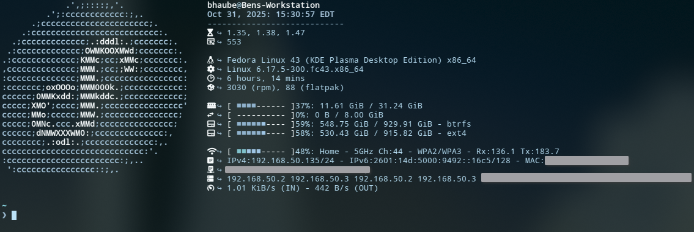
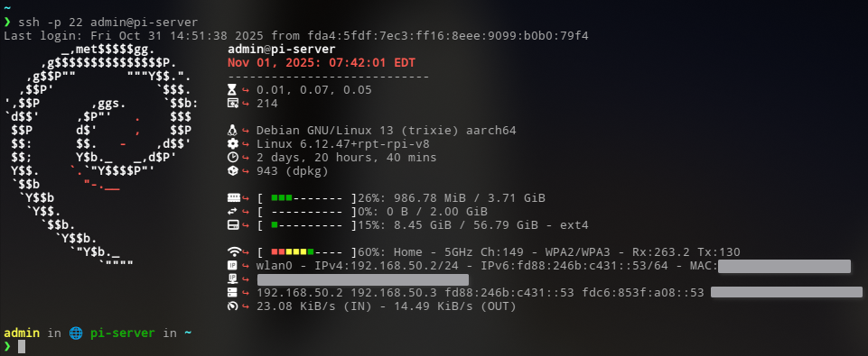
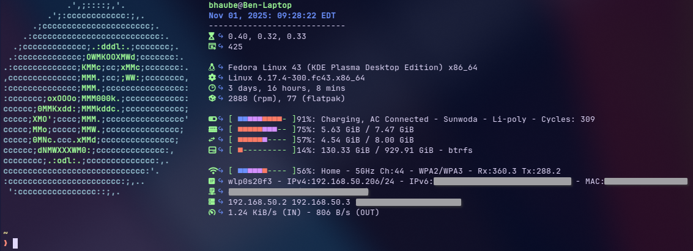

# Fastfetch Login Preset

This is a preset for fastfetch that is intended to run on login when you open a terminal, or login to your server over SSH. It shows relavant system information and an ASCII logo of your operating system. 

***This preset requires a [Nerd Font](https://www.nerdfonts.com/) to be installed and set in your terminal to properly display the icons.***

***If you are using a mobile device (such as a laptop) you can use the*** `login-mobile.jsonc` ***preset instead to show power adaptor and battery information.***

***If your computer does not have an active Wi-Fi connection you can use the*** `login-no-wifi.jsonc` ***preset.***

Here is a list of the modules included with this preset:

+ title (user@hostname) 
+ datetime (MMM dd, yyyy: hh:mm:ss timezone)
+ loadavg (1m, 5m, 15m)
+ processes
+ break
+ OS
+ kernel
+ uptime
+ packages
+ break
+ poweradapter ---- ⚠️ ***[login-mobile.jsonc](https://github.com/benhaube/fastfetch-login-preset/blob/master/login-mobile.jsonc) only***
+ battery *[ {bar}{num}: {status} - {manufacturer} - {technology} - {cycles} ]* ---- ⚠️ ***[login-mobile.jsonc](https://github.com/benhaube/fastfetch-login-preset/blob/master/login-mobile.jsonc) only***
+ memory *[ {bar}{num}: {used} / {total} ]*
+ swap *[ {bar}{num}: {used} / {total} ]*
+ drives *[ {bar}{num}: {used} / {total} - {filesystem} ]*
+ break
+ wifi *[ {bar}{num}: {SSID} - {frequency} {channel} - {encryption} - {Rx} {Tx} ]* ---- ❌ ***not included with [login-no-wifi.jsonc](https://github.com/benhaube/fastfetch-login-preset/blob/master/login-no-wifi.jsonc)***
+ localip *[ {device} - {IPv4} - {IPv6} - {MAC} ]*
+ publicip *[ {IPv4} {location} ]*
+ dns *[ {IPv4} {IPv6} ]*
+ netio *[ {IN} - {OUT} ]*

# Screenshots

### Desktop:



### Server:



### Mobile:



# Install

1. Clone the Github repository:

    ```Bash
    wget https://github.com/benhaube/fastfetch-login-preset.git
    ```
2. Install `fastfetch` if you have not already:

    + Fedora/RHEL based distributions:

        ```Bash
        sudo dnf install fastfetch
        ```
    + Debian/Ubuntu based distributions:

        ```Bash
        sudo apt install fastfetch
        ```
    + Visit the `fastfetch` [Github](https://github.com/fastfetch-cli/fastfetch.git) repository if it is not available in your distribution's package manager. 

3. Backup your `.bashrc` file in case you make a mistake:

    ```Bash
    cp .bashrc .bashrc.bkp
    ```

4. Enter the project directory:

    ```Bash
    cd fastfetch-login-preset/
    ```

5. Copy the file `login.jsonc` to the `/usr/share/fastfetch/presets/` directory and confirm fastfetch can see the preset:

    ```Bash
    sudo cp login.jsonc /usr/share/fastfetch/presets/
    fastfetch --list-presets
    ```
6. Go back to your `/home/user/` directory and edit the `.bashrc` file to add the `fastfetch` command:

    ```Bash
    cd
    nano .bashrc
    ```
7. Add the following to the end of your `.bashrc` file:

    ```Bash
    # Run the fastfetch command with the login.jsonc profile at login to show relavant system information
    fastfetch -c login
    ```
8. `Ctrl+O` and `Enter` to save the changes and `Ctrl+X` to close the file

Now you should be able to open a new terminal window or tab and see the `fastfetch` command run with the `login.jsonc` profile before you get your terminal prompt. 
